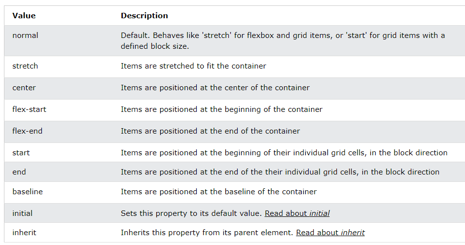
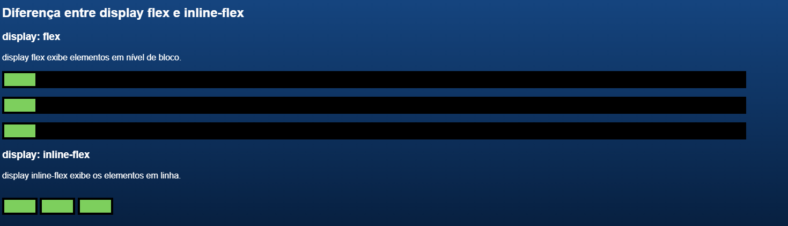
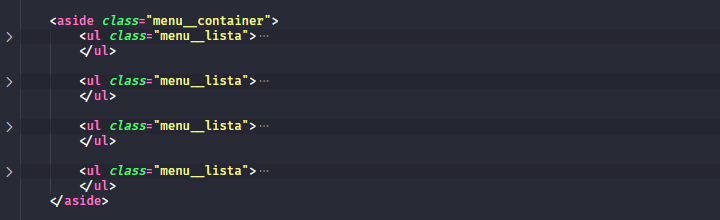

## __#01 Conhecendo o Poder do FlexBox__


Para saber mais: [Guia completo sobre flexbox][1]


`display: flex;`

> Aplicando o valor "flex" a propriedade "display" em um container, fará com  que todos os elementos fiquem um ao lado do outro nesse container.


`justify-content: space-between;`

> Aplicando o valor "space-between" a propriedade "justify-content", fará com  que todos os elementos tenha um espaço entre si (horizontal), sendo este espaço, de acordo como atual tamanho do container.


`align-items: center;`

> Esta propriedade específica o alinhamento dos itens dentro container flexbox. Abaixo estão os possivei valores para essa propridade;



`postion: center;`

> Esta propriedade específica a método de posicionamento para um elemento. Abaixo estão os possiveis valores para essa propridade;
- `static`
- `relative`
- `fixed`
- `absolute`
- `sticky`

> OBS: Elements are then positioned using the top, bottom, left, and right properties. However, these properties will not work unless the position property is set first. They also work differently depending on the position value.


### __@media__


A aplicação de regras com `@media` no CSS permite aplicar estilos a um elemento HTML com base nas caracteristicas do dispositivo ou tamanho da tewla em que o contéudo é exibido. Essa funcionalidade é conhecida como design responsivo ou apatável.

A sintaxe básica do `@media` é a seguinte:

```css
@media (condition){
    /* CSS rules */
}
```
A condição pode ser uma das seguintes 

- `width`: define a largura da viewport (areá vísivel do navegador) em pixels.
- `min-width`: define a largura mínima da viewport em pixels.
- `max-width`: define a largura máxima da viewport em pixels.
- `height`: define a altura da viewport em pixels.
- `min-height`: define a altura mínima da viewport em pixels.
- `max-height`: define a algutura máxima da viewport em pixels.
- `orientation`: define a orienta do dispositivo (retrato ou paisagem).
- `aspect-ratio`: define a relação de aspecto da viewport.
- `min-aspect-ratio`: define a relação de aspecto mínima da viewport.
- `max-aspect-ratio`: define a relação de aspecto máxima da viewport.

Por exemplo, para aplicar um estilo diferente a um elemento HTML quando a largura da viewport for menor que 768 pixels, pode-se usar a seguinte regra:

```css
@media (max-width: 768px) {
  /* regras CSS aqui */
}
```

No caso do projeto, o campos de pesquisa deve aparecer só a partir de uma
determinada largura da viewport, que no caso é 834px. Assim o esse campo irá aparecer apenas quando a largura máxima for maior ou igual a 834px.


```css
.cabecalho__pesquisar_item { 
    display: none;  /* Elemento não deve ser mostrado na tela*/
}


@media (min-width: 834px){ /* Verifica se a largura da tela é >= 834*/
    /* Largura da tela é >= 834*/
    .cabecalho__pesquisar_item{
        display: block; /* Sobrepoem a regra anterior e aplica novos valores a propriedade do elemento*/
    }
}
```
### __Reset CSS__

No projeto deste curso é utilizado o arquivo com nome reset.css. É comum encontrar este mesmo arquivo em muitos projetos por aí. Entretanto, você sabe exatamente por que que ele foi criado e qual sua influência no desenvolvimento de uma interface?

Quando você abre um mesmo arquivo HTML em diferentes navegadores, podendo ser Chrome, Firefox ou Edge, por exemplo, este mesmo arquivo pode aparecer de formas diferentes. Isso acontece porque cada um desses navegadores insere automaticamente uma série de valores divergentes de padding, margin e diversas estilizações do CSS.

Como este problema da falta de compatibilidade entre navegadores tem bastante importância para entender como organizar elementos em uma página, trago o artigo “[Reset CSS][2]" O que é, exemplos, como Criar e utilizar”, escrito pela instrutora Laís Cavalcanti, que explica em detalhes como o reset.css resolve o problema.


## __02# Rodapé responsivo__

[Flex Box Guia Completo][3]


No caso do radapé precisamos que o elementos fiquem em coluna, mas se espalhando apenas dentro do container do rodapé. Para minipularmos podemos usar o display flex, e mudar a direção, em vez de line, usamos colunm;


> "Define se os itens devem quebrar ou não a linha. Por padrão eles não quebram linha, isso faz com que os flex itens sejam compactados além do limite do conteúdo. Essa é geralmente uma propriedade que é quase sempre definida como flex-wrap: wrap; Pois assim quando um dos flex itens atinge o limite do conteúdo, o último item passa para a coluna debaixo e assim por diante."

```css
.rodape__container {
    display: flex;  /*Aplica o display flex*/
    flex-direction: column;  /*Muda a orientação para coluna*/
}

```
Agora precisamos quebrar essas colunas, igualmente, de acordo como tamanho da viewport. Para isso usamos o
`flex-wrap: wrap`


```css
.rodape__container {
    display: flex;  /*Aplica o display flex*/
    flex-direction: column;  /*Muda a orientação para coluna*/
    flex-wrap:  wrap;
}
```

O Flexbox pode ser utilizado alterando o valor do display de um container para flex, ou inline-flex. Vamos descobrir quais são suas diferenças e similaridades.

O que eles têm em comum?
Ambos valores de display permitem alinhar itens com propriedades do Flexbox.

O que eles não têm em comum?
O display: flex faz com que o container se expanda ocupando toda a largura do leiaute(repare na cor preta de background ocupando toda a largura disponível), assim, os outros containers com o mesmo valor de display ficam um embaixo do outro, na direção vertical.

Já o display: inline-flex, utiliza as mesmas características de exibição do display: inline. Exibindo os elementos em nível de linha, na horizontal, sem ocupar toda a largura do leiaute.

Confira abaixo, exemplo de código no editor de código online Codepen, apenas alterando os displays de seus containers para ver na prática suas diferenças:





### __gap__

> A priedade `gap` é utilizada para colocar espaçamento entre os items dentro de um container, de forma que ela nãoa aplica o mesmo espaçamento nas extremidades dos mesmos.


```css
.superior__secao__container {
    display: flex; /* Aplicar o flexbox no container*/
    align-items: center; /* Centralizar os elementos no meio do container*/
    white-space: nowrap; /* Aplicar quebra de linha apenas para os textos (espaços em branco)*/
    overflow: scroll; /* Adicionar barra de rolagem */
    gap: 15px; /*Aplicar espaçamento entre os items*/
    
```
> The gap property defines the size of the gap between the rows and between the columns in flexbox, grid or multi-column layout. It is a shorthand for the following properties:
- row-gap
- column-gap

### __Resumo__

- Aplicamos propriedades flex para:
- Alterar o eixo principal de elementos;
- Quebra de itens em linhas ou colunas;
- Aplicar espaçamento entre itens;
- Definimos as diferenças entre display flex e inline-flex.
 DISCUTIR NO FORUM


## __#03 Menu mobile-first o Poder do FlexBox__


### Para celular...

Neste momento, podemos pensar em arrumar a nossa responsividade para dispositivos móveis, em primeiro plano. Afim de garantir que o conteúdo esteja adptável mobile antes do desktop.


No projeto, queremos que a barra lateral, na tag `<aside>`, fique na parte debaixo da página de maneira fixa. Primeiro devemos pensar em arrumar o container desses elemento, pela sua classe (`.menu__lista`)

__1) Informamos que o container tera uma posição fixa.__

__2) Informamos essa posição.__

__3) Dimiuimos a altura do mesmo.__

__4) Declaramos que a sua largura ocupara todo o espaço dispível do container na tela.__

```css
.menu__container{
    position: fixed; /*{1}*/
    bottom: 0%; /*{2}*/
    height: 74px; /*{3}*/
    width: 100%;/*{4}*/
}

```

Agora devemos organizar os elementos com o flexbox. O menu possuí 4 blocos de lista 



Entretando queremos apenas o primeiro bloco, que contém os 5 elementos. 
para isso podemos usar o `nth-child` que é uma função que seleciona o elemento na posição x, no caso quando temos elementos com classes ou tags iguais, e queremos que alguns tenha caracteristicas específicas

Como é o nosso exemplo:

```css
.menu__lista:nth-child(2), /* Seleciona o segundo bloco .menu_container*/
.menu__lista:nth-child(3), /* Seleciona o terceiro bloco .menu_container*/
.menu__lista:nth-child(4){ /* Seleciona o quarto bloco .menu_container*/
    display: none; /* Aplica display none para todos, menos o 1, que não foi selecionado */
}
```
Agora devemos agrupa-los em no centro e aplicar espaçamento entre eles, usando o flexbox, mas podemos usar em vez de usar uma __propriedade para o elemento pai__ pode usar __propriedades para o elementos-filhos__
que é o caso do `align-self: center` onde o elemento ira se colocar (se alinhar) no centro do container.

```css
.menu__itens li { /*Aplicando para cada li dentro de .menu__itens*/
    align-self: center; /* Cada elemento ira se colcoar no centro do container*/
}
}
```

Após isso:

1 - Aplicamos o espaçamento entre os itens
2 - Mudados a direção do flexbox, de linha (row) para coluna (column)
3 - Adicionamos espaços de 5x apenas entre os elementos com o gap;

```css
.menu__itens {
    display: flex;
    flex-direction: column;
    gap: 5px;
}
```

### Para tablet...

```css

@media (min-width: 834px){
 
    .cabecalho__pesquisar_item{
        display: block;
    }

     .rodape__container {
        justify-content: space-between;
    } 


    .menu__container {
        left: 0;
        height: auto;
        top: 80px;
        width: 74px;
    }

    .menu__lista {
        flex-direction: column;
        justify-content: flex-start;
        padding-top: 15px;
        gap: 33px;
    }
}

```

## __Usando @media para desktop


Nesse momento e necessário organizar os elementos da barra latereal para uma lagura miníma de 1444px.

```css

@media (min-width: 1444px){
    
    .menu__container {
        width: 239px; /* Largura da barra laterial */
        overflow-y: scroll; /* Aplicar barra de colagem para acessar os elementos que ficaram mais embaixo*/
    }

    .menu__lista:nth-child(2),
    .menu__lista:nth-child(3),
    .menu__lista:nth-child(4){
        display: flex; /* Para desktop, as outras listas podem ser mostradas */
    }

    .menu__lista {
        height: auto; /* Essa propriedade ajusta automaticamente a altura do elemento para permitir que seu conteúdo seja mostrado corretamente*/
        padding: 20px 17px 20px 15px; /* Aplicasse um padding para cada bloco de lista*/
        gap: 15px /* Aplica um espaçamento de 15px entre os elementos dentro do elemento pai  .menu_lista */
    
    }

    .menu__itens {
        flex-direction: row; /* Muda o elementos para ficarem um ao lado do outro (em linha) e não encima do outro (coluna)*/
        align-items: center;
        gap: 15px; /* Aplica um espaçamento de 15px entre os elementos dentro do elemento pai  .menu_itens */
    }


    .menu__lista:nth-child(3) {
        flex-direction: column-reverse; /* Inverte a apresentação dos elementos*/
    }


    /* A propriedade order informa a ordem que o elemento será apresentado no css*/
    .jogos {
        order: 3;  /* Terceiro elemento na ordem*/
    }

    .filmes {
        order: 2;  /* Segundo elemento na ordem*/
    }

    .premium {
        order: 1;  /* Primeiro elemento na ordem*/
    }


    .maispagina {
        order: 4; /* Quarto elemento na ordem*/
    }


}


```

## __Flex-item & Flex-container__


O Flexbox permite manipular de forma prática a distribuição de elementos em uma página. A primeira coisa a ser feita para utilizar esta ferramenta é alterar o valor do display de um elemento para display: flex. Dessa forma, tornamos este elemento, um flex-container, e seus elementos filhos passam a ser flex-item.

E então, você pode manipular os elementos de duas formas:

Utilizando propriedades flex-container, que são sempre aplicadas no elemento pai. Possibilitando manipular todos os elementos no seu interior.

E, também, utilizando propriedades flex-item, estas são sempre aplicadas em cada elemento que deseja manipular.

[Documentation about Flex Container][4]

[Documentation about Flex Item][5]


## __#05 Flex grow__

Você pode utilizar o flexbox para organizar as descrições, mas também existe uma outra solução de layout muito interessante, chamada display: grid. O grid é muito eficiente também nesse caso, quando precisamos organizar muitos itens em níveis diferentes dentro de um container.
[CSS Grid Layout][6]


> The flex-grow property specifies how much the item will grow relative to the rest of the flexible items inside the same container. 


```css

/*videos*/

.videos__container {
    display: flex;
    flex-wrap: wrap;
    gap: 10px;
    

    
}

.videos__item {
    height: 303px;
    width: 280px;
    flex-grow: 1;
}


.descricao-video {
    display: grid;
    text-align: start;
    column-gap: 1rem;
    row-gap: 10px;
    grid-template-columns: auto 1fr;
}

.descricao-video img {
    grid-area: 1 / 1 / 3 / 2;
}


```
__`flex-shrink`__

A propriedade 'flex-shrink' é ideal para ser aplicada quando queremos encolher elementos à medida que o seu container diminui de largura.
> The flex-shrink property specifies how the item will shrink relative to the rest of the flexible items inside the same container.

```css
/* Exemplo */

.item-1 {
    background-color: #d34f26; 
    flex-shrink: 5;
}

.item-2 {
    background-color: #68b6e2;
    flex-shrink: 1;
}

.item-3 {
    background-color: red;
    flex-shrink: 1;
}

.item-4 {
    background-color: rgb(0, 217, 255);
    flex-shrink: 1;
}

```


# Tags

```html
<aside></aside>
```
O elemento HTML <aside> representa uma seção de uma página que consiste de conteúdo que é tangencialmente relacionado ao conteúdo do seu entorno, que poderia ser considerado separado do conteúdo. Essas seções são, muitas vezes, representadas como barras laterais. Elas muitas vezes contem explicações laterais, como a definição de um glossário; conteúdo vagamente relacionado, como avisos; a biografia do autor; ou, em aplicações web, informações de perfil ou links de blogs relacionados.


[1]:https://css-tricks.com/snippets/css/a-guide-to-flexbox/ "Guia completo sobre flexbox"
[2]:https://www.alura.com.br/artigos/o-que-e-reset-css "Reset CSS"
[3]:https://origamid.com/projetos/flexbox-guia-completo/ "Flexbox Guia Completo"
[4]:https://www.w3schools.com/css/css3_flexbox_container.asp "Flexbox Container"
[5]:https://www.w3schools.com/css/css3_flexbox_items.asp "Flexbox Items"
[6]:https://www.alura.com.br/artigos/criando-layouts-com-css-grid-layout "CSS Grid Layout"